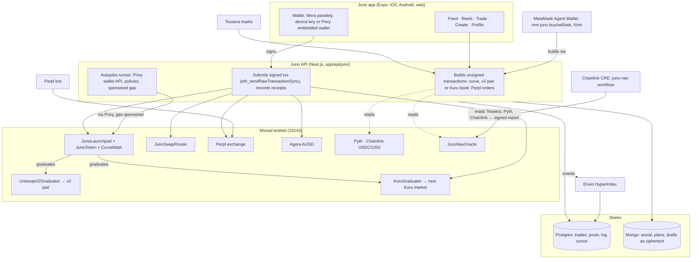

# Juno — every post is a market

**Post a photo or a reel and it launches its own token on a bonding curve on
Monad.** People buy into the post itself as they scroll, the creator earns the
trading fees instead of ad revenue, and when the curve fills it graduates —
into a Uniswap v2 pair, or, if the creator chose it, into **its own Kuru
order-book market** — with the liquidity locked for good: a market that
outlives the app.

The same machinery issues **pre-IPO and stock trackers**: curves shaped like
issuances and marked against a real reference — **Tessera** marks for OpenAI,
Kalshi and SpaceX, **Pyth** feeds for AAPL, NVDA, TSLA and friends.

Built for Monad's **Metropolis** hackathon — Track 01, *Onchain Finance &
Trading*: a creator launchpad whose coins graduate into real on-chain order
books, with perps on Perpl and pre-IPO trackers beside them.

**Try it:** <https://juno-monad-app.vercel.app> — Monad testnet, nothing to
install. Profile → *Sign with* → **Passkey** makes an account from one
passkey prompt.

| | |
|---|---|
| **Network** | Monad **testnet** (chain 10143). No real money. |
| **Contracts** | [`contracts/`](contracts/) — `JunoLaunchpad` [`0xa8b0…5c81`](https://testnet.monadvision.com/address/0xa8b009c7848c9f4Fd4dD9447a385DaFB8B865c81), `JunoToken`, `UniswapV2Graduator`, `KuruGraduator`, `JunoSwapRouter`, all verified on MonadVision; every address in [`contracts/deployments/10143.json`](contracts/deployments/10143.json). |
| **App** | <https://juno-monad-app.vercel.app> · [`juno-expo/`](juno-expo/) — Expo (iOS, Android, web). |
| **API** | <https://juno-api-production-04ea.up.railway.app> · [`app/api/juno/`](app/api/juno/) — the Next.js server the app talks to. [docs/API.md](docs/API.md). |
| **Indexer** | [`indexer/`](indexer/) — Envio HyperIndex over the launchpad's events. |
| **Deep dive** | [JUNO.md](JUNO.md) — the curve, the contracts, what is and is not built. |
| **For judges** | [docs/SUBMISSION.md](docs/SUBMISSION.md) — the track, each bounty with its evidence, and a 3-minute demo script. |

## Run all of it locally, in one command

```bash
git clone --recurse-submodules https://github.com/nickthelegend/juno-monad && cd juno-monad
npm install && (cd juno-expo && npm install)
npm run demo:local
```

This forks Monad testnet with anvil, so Juno's deployed contracts, Kuru,
Perpl, Agora's AUSD, Pyth and Chainlink's feeds are all there. It makes a
fresh Postgres and Mongo, builds the API for production, and seeds the demo
content through the API as real signed transactions: fourteen coins with
trades and comments, one of them graduated into Uniswap v2 and one into Kuru.
Then it serves the web app at <http://localhost:8183>. It needs no keys. A
run on 6 Oct took 3½ minutes, and every screen passes `tests/e2e/walk.mjs`
against it (50/50 on 7 Oct).

It needs Foundry, Node 22+, PostgreSQL 16 (running) and MongoDB 7 on PATH.
`npm run demo:local -- stop` stops everything it started. The script is
[`scripts/local-demo.sh`](scripts/local-demo.sh).

## Install it

The web app is live at <https://juno-monad-app.vercel.app> against the hosted
API — nothing to install. To run a phone build against your own stack, set it
up as *Run it* below says and start the API on port 3100 with
`npm run dev -- --port 3100`.

- **Android emulator:** `adb install juno-monad-1.1.0-arm64.apk`. The APK
  reaches the host at `http://10.0.2.2:3100`; plain HTTP is allowed to that
  address and loopback only.
- **iOS Simulator (Mac with Xcode):** unzip `juno-monad-1.1.0-ios-simulator.zip`,
  then `xcrun simctl install booted Juno.app && xcrun simctl launch booted app.launch.junomonad`.
- **Web:** `cd juno-expo && EXPO_PUBLIC_API_URL=http://localhost:3100 npx expo start --web`.

Profile → **Wallet** → *Get testnet MON* funds a new wallet from Juno's faucet.

## Sixty seconds in the app

1. **Feed** — posts, each one a market: worth, likes, replies, share, **Buy**.
   "Bought by" is read from real trades.
2. **Reels** — full-screen video; tap for sound, double-tap to like, and a dock
   under the caption with the reel's market cap, curve progress, **Sell** and **Buy**.
3. **Trade → Pre-IPO** — OpenAI, Kalshi, SpaceX from Tessera's marks, with the
   Juno curve tracking each and how far its implied price sits from the mark.
4. **+ → Post a photo** — pick a photo, name it, pick a curve shape; **one
   signature** later it is a live market with your post on it.
5. **Profile** — laid out like any creator profile people know: avatar,
   name, bio and link (signed by the wallet), posts, followers and following,
   highlights for reels and graduated coins, and a three-column grid of every
   post with its coin's price change. Tabs for Reels, Coins and what they
   back. On your own profile, *Edit profile*, and a **Wallet** tab: fund it
   from the testnet faucet, see holdings, cost basis and P&L, watchlist and
   plans.

Every number is read from the chain, Postgres, Mongo, Pyth or Tessera. When a
read fails the app says so — it does not print a zero it never measured.

## What makes it more than a launchpad

- **Sixteen-range curves with a shape.** A curve is a start price and sixteen
  ranges, each holding its own liquidity — concentrated-liquidity maths, in
  [`CurveMath.sol`](contracts/src/libraries/CurveMath.sol). The weights are the
  character of a launch: `content` (back-loaded), `thin-name` (front-loaded, for
  a low-float stock), `ipo-book` (deep at both ends), `tight-nav` (uniform,
  tracks a reference). The TypeScript builder and the contract share one
  arithmetic, and a parity test holds them to it.
- **Graduation is continuous.** The base reserved for the AMM is the curve's
  quote priced at the curve's top, so the pair opens at exactly the price the
  curve finished on. The pair's address is fixed at launch and the token
  refuses transfers into it until then, so nobody can seed it at a price of
  their choosing first — and the pair itself is only deployed when a curve
  graduates, so a launch costs about 2M gas instead of 4.6M.
- **Choose where it graduates: Uniswap v2 or Kuru.** A creator picks the venue
  at launch. With Kuru, the filled curve opens a new spot market for the token
  on Kuru's CLOB, seeds the market's AMM vault with the curve's reserves at the
  curve's final price, and burns the vault shares — every post that fills
  becomes a new asset with an order book
  ([`KuruGraduator.sol`](contracts/src/graduators/KuruGraduator.sol)). The token
  refuses transfers into Kuru's MarginAccount until then, which closes every
  way into Kuru — orders, vault deposits, router swaps — so nobody can price it
  there first. After graduation the app keeps trading the coin on its Kuru
  market (quoted free through Kuru's own `eth_call` path), and the indexer
  follows it there. Trade → **Kuru** lists every market Juno has opened.
  Testnet only: Kuru's mainnet Router lets only Kuru create markets.
- **Perps beside the posts.** The Trade tab carries Perpl's perpetual markets —
  BTC, ETH, SOL, MON and more, isolated margin in AUSD — with live marks,
  funding and open interest, and opens and closes positions through the same
  wallet and server-built transactions as everything else
  ([`lib/juno/perpl.ts`](lib/juno/perpl.ts)). Kuru has no perps; Perpl is
  Monad's perps exchange. Collateral comes from **Agora's AUSD faucet** in the
  app (10,000 test AUSD a request), and a **Risk** view reads Perpl's public
  API for each market's funding (now, annualised, the last day's payments),
  premium to the oracle and realised volatility, and for each position its
  leverage on equity, distance to liquidation and margin health.
- **Fees that decay, paid to the poster.** A launch fee that blunts snipers
  decays exponentially to a resting fee over sixty periods. The creator takes
  the trading fees, claimable any time.
- **One transaction per action.** Launch — token, curve, the lock on its AMM pair and the
  creator's optional first buy — is one call. Selling needs no approval.
- **A passkey is the whole account (Mera).** One passkey prompt makes a
  wallet: Mera's WebAuthn PRF output becomes a standard BIP-39/BIP-44 key, so
  the same passkey brings back the same address on any device or after the
  browser is cleared, and nothing secret is stored. An unlock opens a
  15-minute **signing session** — trades sign with no prompt, a countdown on
  the profile, *End session* wipes the key — and the passkey does a second
  job: **sealed drafts**, a post's words encrypted to it under their own PRF
  salt and kept on the server as ciphertext ([`juno-expo/lib/mera.ts`](juno-expo/lib/mera.ts)).
- **Keys never leave the device — or sign in with Privy.** The server builds
  unsigned transactions; the wallet signs; the server submits and records
  what the receipt says. The wallet is a device key by default, or a Privy
  embedded wallet: on the web behind email, Google or X sign-in with Privy's
  own confirmation on every trade and launch, on iOS and Android behind an
  email code in Juno's own sheet. An X account linked in Privy can be
  shown on the creator's profile once the server has verified it with Privy
  ([`lib/juno/privy.ts`](lib/juno/privy.ts)).
- **Autopilot: plans that buy themselves, gas paid by Privy.** A Privy
  wallet can add Juno's key as a session signer, under a Privy policy
  written for that wallet. The policy allows only Juno trades paid out to
  it, caps the MON per trade, and expires. Recurring buys then run on
  schedule, sent through Privy's wallet API with native gas sponsorship
  ([`docs/AUTOPILOT.md`](docs/AUTOPILOT.md)).
- **Tracker NAVs attested on chain by Chainlink CRE.** The `juno-nav`
  workflow does three things on each run. It reads Tessera marks with DON
  consensus, plus Pyth and Chainlink's USDC/USD feed on Monad. It compares
  them with each tracker's curve. It writes the premium to `JunoNavOracle`,
  and the coin page shows the attestation ([`cre/README.md`](cre/README.md)).
- **Trade Juno from an agent.** `mm juno buy/sell` brings Juno's curves,
  pairs and Kuru books to the MetaMask Agent Wallet. `mm juno ask "…"` lets
  Kimi plan the trade with tool calls, inside a spend cap
  ([`mm-plugin-juno/`](mm-plugin-juno/README.md)).
- **A Perpl bot.** Funding carry and a position guard on Perpl's API, with
  caps, a daily loss limit and a kill switch ([`docs/PERPL-BOT.md`](docs/PERPL-BOT.md)).
- **History without hammering the RPC.** Monad's public RPC answers
  `eth_getLogs` over 100 blocks — thirty seconds of chain. Trades are recorded
  from receipts as they land, a single log cursor tails the launchpad for the
  rest, and the Envio indexer serves full history.

## Why Monad

- **A buy that lands mid-scroll.** The server submits with
  `eth_sendRawTransactionSync`, and the receipt comes back in the same call.
  The trade receipt shows the confirmation time it measured, and the live
  tape follows each trade through Monad's commit states (Proposed → Voted →
  Finalized) over its WebSocket.
- **Cheap enough to price a single post.** A launch is one transaction of
  about 2M gas: the token, the curve, the lock on its future pair and the
  creator's first buy.
- **Native venues to graduate into.** Kuru's on-chain order book is on Monad,
  so a coin that fills can open its own spot market, seeded and locked. Perpl's
  perps and Agora's AUSD sit beside it in the same app and wallet.
- **Built for Monad's rules.** Monad charges the gas limit, not the gas used,
  so every limit is an estimate plus a measured margin. Juno's faucet never
  pays out below Monad's 10 MON sender reserve. The public
  RPC answers `eth_getLogs` over 100 blocks only, so history comes from
  receipts, one log cursor and Envio.

## Architecture



Every number on screen is read from the chain, Postgres, Mongo, Pyth,
Tessera or Perpl. The server never holds a person's key: it builds, the
wallet signs, the server submits and records what the receipt says.

## Sponsor integrations

| Sponsor | What Juno does with it | Code | Proof |
|---|---|---|---|
| **Kuru** | A coin whose creator picks Kuru opens its **own Kuru spot market** when its curve fills (v1 `Router.deployProxy`), seeded from the raise and locked. The app then trades it on the book: market orders, limit orders, cancel, withdraw. | [`KuruGraduator.sol`](contracts/src/graduators/KuruGraduator.sol), [`lib/juno/kuru.ts`](lib/juno/kuru.ts) | Fork tests against Kuru's live contracts; E2E F1–F4 |
| **Perpl** | Perps in the Trade tab with AUSD margin; a **Risk** view (funding, premium, volatility, liquidation distance, margin health); a funding-carry and position-guard **bot** on Perpl's API | [`lib/juno/perpl.ts`](lib/juno/perpl.ts), [`scripts/perpl-bot.ts`](scripts/perpl-bot.ts) | E2E G5 and X1 (a real BTC short opened and closed on a fork) |
| **Agora** | AUSD from Agora's faucet in the app, used as Perpl margin, with Mera sign-in | [`lib/juno/perpl.ts`](lib/juno/perpl.ts) | E2E on real testnet, 5 Oct ([E2E-HOSTED.md](docs/E2E-HOSTED.md)) |
| **Mera** | A passkey is the whole account, with signing sessions; **sealed drafts** use a second PRF salt to encrypt a post's words to the passkey | [`juno-expo/lib/mera.ts`](juno-expo/lib/mera.ts) | E2E P1–P4 |
| **Privy** | Embedded wallets (web, iOS, Android); **autopilot**: Juno's session signer under a per-wallet policy, plans run through Privy's wallet API with **gas sponsorship** | [`lib/juno/autopilot.ts`](lib/juno/autopilot.ts), [`lib/juno/privy-policy.ts`](lib/juno/privy-policy.ts) | Unit tests; live run awaits the owner's Privy signer ([AUTOPILOT.md](docs/AUTOPILOT.md)) |
| **Chainlink** | CRE workflow `juno-nav` attests tracker NAVs on Monad (Tessera over HTTP with consensus, Pyth, Chainlink USDC/USD) into `JunoNavOracle` | [`cre/juno-nav/`](cre/juno-nav/), [`JunoNavOracle.sol`](contracts/src/cre/JunoNavOracle.sol) | Workflow and receiver tests; a report through Monad's MockKeystoneForwarder on a fork |
| **MetaMask** | Agent Wallet plugin: `mm juno markets / coin / buy / sell / portfolio / ask` | [`mm-plugin-juno/`](mm-plugin-juno/) | 20 tests; installs in `mm` 7.0.0; 11-check fork E2E of the trade path |
| **Kimi** | `mm juno ask "…"`: Kimi K2.6 plans a trade with tool calls that execute on Monad, inside a spend cap | [`mm-plugin-juno/src/lib/agent.ts`](mm-plugin-juno/src/lib/agent.ts) | Tool-loop tests; live run needs a Moonshot key |
| **Envio** | HyperIndex over the launchpad, tokens, Kuru markets and v2 pairs, with derived positions, pool stats and open orders; self-hosted | [`indexer/`](indexer/) | Handler tests; hosted on Railway since 1 Oct |
| **Pyth, Tessera** | Stock trackers marked against Pyth on Monad; pre-IPO trackers against Tessera's marks | [`lib/juno/pyth.ts`](lib/juno/pyth.ts), [`lib/juno/tessera.ts`](lib/juno/tessera.ts) | E2E G1–G2 |

What has run on real Monad testnet and what has run only on a local fork is
listed item by item in [docs/TEST-PLAN-ZERO-MOCK.md](docs/TEST-PLAN-ZERO-MOCK.md).

## Layout

| Path | What |
|---|---|
| `contracts/` | Foundry project: the launchpad, the token, the graduator, tests, deploy script. |
| `juno-expo/` | **The app** — Expo (iOS, Android, web). |
| `app/api/juno/` | The API the app calls. |
| `lib/juno/` | Curves, the launchpad client, trade history, Pyth, Tessera, portfolio. |
| `indexer/` | Envio HyperIndex: trades, pools, positions. |
| `cre/` | Chainlink CRE workflow `juno-nav` (tracker NAV oracle). |
| `mm-plugin-juno/` | MetaMask Agent Wallet plugin: `mm juno …`, with Kimi. |
| `scripts/juno-*.ts` | Launch, trade, claim, graduate from the command line; `scripts/perpl-bot.ts`, the Perpl bot. |
| `scripts/local-demo.sh`, `scripts/fork/` | The one-command local demo, and the keeper that keeps Perpl's marks live on a fork. |
| `docs/` | API reference and hackathon notes. |

## Run it for development

```bash
git clone --recurse-submodules <this repo> && cd juno-monad
npm install
cp .env.local.example .env.local      # DATABASE_URL, MONGODB_URI, PINATA_JWT, the launchpad address
npm run db:migrate
npm run dev                            # API on http://localhost:3000

cd juno-expo && npm install
npx expo start                         # i = iOS simulator, a = Android, w = web
```

Contracts: `cd contracts && forge test`. Unit tests: `npm run test:unit`.
Deploying the contracts and the app: [DEPLOY.md](DEPLOY.md).

## Built in the Metropolis window (1 Sep – 13 Oct 2026)

**Nothing predates the window.** Juno's first line was written on
**16 September 2026**, as a Solana app: Meteora's Dynamic Bonding Curve for
the curves and DAMM v2 for graduation. That version's history is in
[nickthelegend/zorr-solana](https://github.com/nickthelegend/zorr-solana),
and it is the base this repository was ported from. The port to Monad
started on **24 September 2026**, and its whole history is in this
repository: no commit was squashed.

| Date | What was built |
|---|---|
| 16–23 Sep (Solana repo) | The Expo app's screens and design; the four curve presets and their weights; the social layer (follows, likes, comments, names, plans); the API's shape and its "never print an unmeasured zero" rules |
| 24 Sep | Juno's own contracts on Monad (`JunoLaunchpad`, `JunoToken`, `CurveMath`, `UniswapV2Graduator`, `KuruGraduator`, `JunoSwapRouter`) and their Foundry tests; the TypeScript curve builder with a Solidity parity test; the EVM wallet, signing and submission; trade history from receipts, a log cursor and Envio; Perpl perps; Monad's commit states on the live tape |
| 29 Sep – 1 Oct | Trading after graduation (v2 and Kuru); Privy on iOS and Android; native builds; a full end-to-end pass; **deployed and verified on Monad testnet**, with the API, indexer and app hosted |
| 5 Oct | Track 01: Agora's AUSD faucet, the Perpl risk view, Kuru's markets on the Trade tab, Mera passkey accounts and sealed drafts |
| 6 Oct | The Perpl bot; Privy autopilot (policies, session signers, gas sponsorship); Chainlink CRE `juno-nav` and `JunoNavOracle`; the MetaMask Agent Wallet plugin with Kimi; native Mera; zero-mock verification on a production build; lint |
| 7 Oct | The creator profile, laid out like Instagram: signed bio and link, highlights, a grid of posts with their price change, Reels, Coins and Backed tabs, Edit profile, and the wallet in its own tab |

**External code**, all under its own licence: OpenZeppelin Contracts, Uniswap
v2-core (GPL-3.0, compiled unmodified for testnet's v2 factory through
[`contracts/src/vendor/UniswapV2Core.sol`](contracts/src/vendor/UniswapV2Core.sol))
and forge-std, as git submodules in `contracts/lib`; and Chainlink's
`ReceiverTemplate` and `IReceiver`, copied from the CRE docs into
[`contracts/src/cre/vendor/`](contracts/src/cre/vendor/). The Kuru interface
is written from Kuru's SDK ABIs and its deployed contracts. Demo media is
free-licence Pexels footage.

**AI tools.** Most of the code and docs in this repository were written with
**Claude Code** (Anthropic's coding agent), directed by the author. Nothing
the app shows is generated: every number is read from the chain or a named
source. The contracts are covered by 83 Foundry tests, including fuzzed
invariants, and each sponsor integration has its own tests. The zero-mock
run on a production build is recorded in
[docs/TEST-PLAN-ZERO-MOCK.md](docs/TEST-PLAN-ZERO-MOCK.md). Kimi is part of
the product (`mm juno ask`), not a build tool.

## License

MIT — see [LICENSE](LICENSE).
